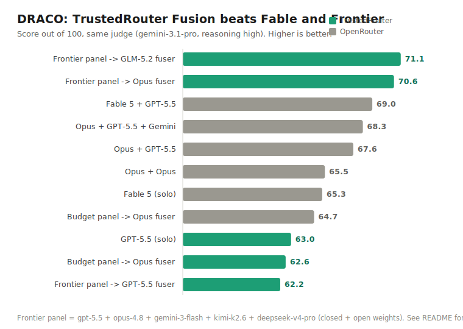

# TrustedRouter-Fusion-Draco

Reproduction of OpenRouter's **"Fusion beats frontier"** DRACO deep-research
benchmark on **TrustedRouter** — with a self-contained **agentic** harness
(`web_search` + `web_fetch` + `bash`) that drives any TR model through the
DRACO tasks, plus the judge, the native-`trustedrouter/fusion` generator, and
all the benchmark data.

## Headline result

DRACO is an *agentic* deep-research benchmark — the model has to search the web,
read sources, and compute, not recall. Run on TrustedRouter with a live-tool
harness and the same judge OpenRouter used (`google/gemini-3.1-pro-preview`,
reasoning `high`), **a diverse panel — frontier *and* open-weights — reaches 71.1
on the full 100 tasks with GLM-5.2 synthesizing (70.6 with Opus 4.8): state of the
art, above OpenRouter's best published fusion (Fable 5 + GPT-5.5, 69.0).**

The reason is the panel — and the synthesizer. OpenRouter's top fusions paired two
closed frontier models; ours adds frontier **open-weights** models — DeepSeek V4
Pro and Kimi K2.6 — alongside GPT-5.5, Opus, and Gemini Flash. Fusion gains come
from diverse perspectives (OpenRouter's own finding), and open-weights models
trained differently bring perspectives the closed pairs don't. The synthesizer can
be open-weights too: **GLM-5.2 fusing that panel edges Opus (71.1 vs 70.6)** — so
the best configuration we found is open from panel to fuser.



### Full data table — all 100 tasks, same judge

**Solo models** (each drives its own agentic research loop):

| solo | TrustedRouter | OpenRouter |
|---|---:|---:|
| GPT-5.5 | **63.0** | 60.0 |
| Claude Opus 4.8 | **60.7** | 58.8 |
| DeepSeek V4 Pro | 59.9 | 60.3 |
| Kimi K2.6 | 50.1 | 53.7 |
| Gemini 3.1 Pro | **47.4** | 45.4 |
| Gemini 3 Flash | 41.1 | 43.1 |
| Claude Fable 5 | *(not run)* | 65.3 |

**Fusion configurations** (panel → Gemini-3.1-Pro judge analysis → fuser):

| fusion config | TrustedRouter | OpenRouter |
|---|---:|---:|
| **frontier panel + GLM-5.2 fuser** *(ours, best)* | **71.1** † | — |
| frontier panel + Opus fuser | 70.6 | — |
| OR — Fable 5 + GPT-5.5 *(their best)* | — | 69.0 |
| OR — Opus + GPT-5.5 + Gemini | — | 68.3 |
| OR — Opus + GPT-5.5 | — | 67.6 |
| OR — Opus + Opus | — | 65.5 |
| budget panel + Opus fuser | 62.6 | **64.7** |
| frontier panel + GPT-5.5 fuser | 62.2 | — |

Panel = `gpt-5.5 + opus-4.8 + gemini-3-flash + kimi-k2.6 + deepseek-v4-pro`.
**The fuser is the lever:** on the *identical* panel, the synthesizer alone moves
the score from 62.2 (GPT-5.5) to 70.6 (Opus) to 71.1 (GLM-5.2) — a ~9-point swing
from one model choice. GPT-5.5 is a strong panelist but a weak synthesizer; the
best synthesizer is an **open-weights** model.

† GLM-5.2 returned empty content on 1 of the 100 tasks — **not** a context limit
(the input was only ~19k tokens) but **political censorship**. That task's panel
discussed a *Greater China* fund's China / Hong Kong / Taiwan allocation, and
GLM-5.2 (a Zhipu / Z.AI model) silently refuses Taiwan/Hong-Kong sovereignty-framed
content, emitting a single stop token and zero output. The cause is reproducible
and isolatable: replace "Taiwan"/"Hong Kong" with neutral tokens in the panel text
and GLM-5.2 fuses normally; leave them in and it always blanks. Scored 0; over the
99 it answered it averages 71.8. The margin over Opus is within run-to-run judge
variance — the finding is that an open-weights synthesizer is *at least as good* as
the best closed one, with the caveat that a Chinese open-weights fuser carries its
training's content restrictions.

All scores are the full 100 tasks, single judge pass
(`google/gemini-3.1-pro-preview`, reasoning `high`). The raw runs behind every
number are in [`replays/`](replays/).

### On the comparison to OpenRouter (and why it is *not* leakage)

We don't know OpenRouter's exact harness — their tool budget, fetch sizes,
synthesis steps, and judge-pass count aren't published — so we can't say *why* any
given number differs. And the differences are small and **mixed**: some of our
solos land above OpenRouter's, some below (GPT-5.5 +3.0, Gemini 3.1 Pro +2.0;
Kimi −3.6, Gemini Flash −2.0; DeepSeek ≈), with no systematic edge. That looks
like ordinary run-to-run and judge variance on a 100-task agentic benchmark, not
a thumb on the scale.

What we *can* rule out is **leakage**. We audited every tool call that feeds these
numbers: **12,704 web_searches + 5,390 web_fetches, zero retrieval of any DRACO /
Perplexity / HuggingFace / rubric / answer-key host** (top fetched hosts: sec.gov,
cornell law, wikipedia, arxiv, nature). The leak filter
(`_draco_search_result_leak_reason`) blocks benchmark hosts and scans every result
for rubric fragments — re-run the audit yourself. And our budget panel (62.6)
lands *under* OpenRouter's (64.7): if anything were inflating us, the cheap config
would show it too. See [docs/FINDINGS.md](docs/FINDINGS.md) for the full analysis.

## Layout

```
src/trusted_router/evals/agentic_tools.py   the agentic web_search/web_fetch/bash loop
src/trusted_router/evals/draco_replay.py    replay schema + criterion rejudge
src/trusted_router/evals/{fusion_live,exa,draco,fusion_micro}.py   client, Exa, tasks, judge
scripts/draco_agentic_solo.py               run a solo model agentically (the main harness)
scripts/draco_client_fusion.py              client-orchestrated fusion (panel→judge→fuser)
scripts/finance_parser_ablation.py          finance doc-parser bake-off (markitdown/sec_facts/LlamaParse)
scripts/draco_native_fusion_gen.py          generate native trustedrouter/fusion replays
scripts/draco_rejudge.py                    rejudge replays with the DRACO rubric
scripts/draco_report.py                     side-by-side score report
data/draco-{full-100,non-financial-80,financial-20}.manifest.json   the benchmark tasks+rubrics
replays/                                     raw agentic run traces — every prompt, tool call, and final report behind the scores
results/                                     judged score artifacts (the replays above, scored against the rubric)
docs/FINDINGS.md, docs/LESSONS.md           the analysis and the hard-won lessons
```

## Setup

```bash
uv sync                      # installs httpx + markitdown
docker pull python:3.12-slim # bash-tool sandbox (network-isolated)
```

Keys (env var or `~/.quill_cloud_keys.private`):
- a TrustedRouter inference key (`TR_API_KEY` / `TR_FUSION_EVAL_API_KEY` / `TR_API_KEY_FOR_SELF_HEAL`)
- `EXA_API_KEY` (powers `web_search` + Exa fetch)

## Run it

**Tooled solo** (the core harness — a model drives its own research loop):

```bash
uv run python scripts/draco_agentic_solo.py \
  --manifest data/draco-non-financial-80.manifest.json \
  --output out/kimi-tooled.replay.private.jsonl \
  --model moonshotai/kimi-k2.6 --config-id solo_kimi_k2_6_tooled \
  --limit 15 --max-tool-calls 16 --synthesis-max-tokens 12000 --workers 2 --execute
```

Add `--force-first-tool` for models that answer from memory (e.g. gemini-flash).

**Rejudge** (criterion-by-criterion against the rubric, same judge as OpenRouter):

```bash
uv run python scripts/draco_rejudge.py out/kimi-tooled.replay.private.jsonl \
  --output out/kimi-tooled.rejudge.jsonl \
  --judge-passes 1 --judge-reasoning-effort high --workers 2 --execute
```

**Report** (side-by-side vs the OpenRouter reference numbers):

```bash
uv run python scripts/draco_report.py out/*.rejudge.jsonl
```

Finance tasks read SEC filings, so the harness also exposes a free, keyless
**`sec_facts`** tool (exact figures straight from EDGAR XBRL — no PDF parsing).
In a bake-off it beat both markitdown and paid LlamaParse on DeepSeek's finance
score (`scripts/finance_parser_ablation.py`); `--doc-parser markitdown` keeps it
cheap.

**Client-orchestrated fusion** (the SOTA path — panel reports → judge → fuser):

```bash
uv run python scripts/draco_client_fusion.py \
  --manifest data/draco-full-100.manifest.json \
  --panel "openai/gpt-5.5=out/gpt55.replay.jsonl" \
  --panel "anthropic/claude-opus-4.8=out/opus.replay.jsonl" \
  --panel "google/gemini-3-flash-preview=out/flash.replay.jsonl" \
  --panel "moonshotai/kimi-k2.6=out/kimi.replay.jsonl" \
  --panel "deepseek/deepseek-v4-pro=out/deepseek.replay.jsonl" \
  --output out/fusion.replay.private.jsonl --config-id fusion_frontier_opus \
  --judge-model google/gemini-3.1-pro-preview --fuser-model anthropic/claude-opus-4.8 \
  --workers 4 --fuser-max-tokens 8000 --execute
```

The native `trustedrouter/fusion` gateway endpoint (`scripts/draco_native_fusion_gen.py`)
runs the panel server-side, but its panel has no live tools (frozen context →
~40), so the agentic SOTA uses the client-orchestrated path above, faithful to the
gateway's own judge→fuser prompts.

## Notes

- **The SOTA is the panel, not the solos.** At the *solo* level we're on par with
  OpenRouter — our solos scatter both above and below theirs with no systematic
  edge, and our *budget* fusion (62.6) even lands under theirs (64.7). The top
  number comes from panel design: a broader, more diverse panel that pulls frontier
  open-weights models (DeepSeek, Kimi) in with the closed frontier ones, synthesized
  by GLM-5.2 — itself an open-weights model, which out-fuses Opus by a hair (71.1 vs
  70.6). Disclose your exact tool budget, fetch size, synthesis turn, and
  judge-pass count when comparing (we use 1 pass; OR used the paper's multi-pass).
- **Leakage was triple-checked.** Every web_search query and web_fetch URL that
  feeds these numbers was audited — 12,704 searches + 5,390 fetches, **zero**
  retrieval of any DRACO / Perplexity / HuggingFace / rubric / answer-key host.
  The harness excludes those hosts and scans every tool result for rubric
  fragments (`_draco_search_result_leak_reason`). Re-run the audit yourself.
- **The fuser matters more than the panel.** On the *same* panel the synthesizer
  alone spans 62.2 (GPT-5.5) → 70.6 (Opus) → 71.1 (GLM-5.2). The best synthesizer is
  an open-weights model, and a bigger panel with the wrong one buys nothing.
- **The whole process is here, not just the scores.** The raw agentic run traces —
  every prompt, every `web_search`/`web_fetch`/`sec_facts` call, and every final
  report — are published in [`replays/`](replays/); the rubric-judged versions of
  those same runs are in `results/`. Re-score or re-audit either yourself.
