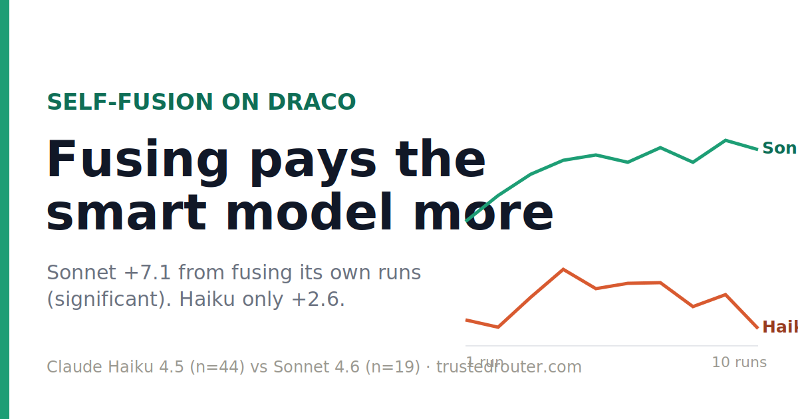

# Ten cheap runs fuse to nothing

Last month OpenRouter showed a cheap trick that beats an expensive model: run a small model ten times on a hard research question, have it read its own ten answers, and write one combined answer that scores higher than any single run. MiniMax-M3 went from 66.2 to 69.4 on the DRACO research benchmark doing exactly that, for about a third of the frontier price. I wanted to know how far down you can push it, so I ran the same experiment with Claude Haiku 4.5, about as cheap as a capable model gets, wired through Claude Code subagents: Haiku does the web research, Haiku reads its own ten reports, Haiku writes the fused answer. A Sonnet 4.6 grader scores it.

Fusing ten Haiku runs does nothing. Solo Haiku scores 62 on my eight-task slice. Two runs fused drops it to 55. Ten runs fused lands at 59. The whole curve wanders under the solo score and never climbs. The trick that lifted M3 four points leaves Haiku flat, or a touch worse.

The clearest way to see what goes wrong is a needle-in-a-haystack task, where the score hinges on one fact buried in a long context. A single Haiku run finds the needle and scores 87. Then fusion loses it. Nine of the ten runs missed the needle and one caught it, and when Haiku reads all ten and writes the consensus it sides with the nine. The fused score falls to 63. Reading its own runs and combining them talked the model out of the answer it already had.

Then I swapped Haiku for Sonnet 4.6 in every seat and changed nothing else: same research loop, same fusion prompts, same grader, same tasks. Sonnet self-fusion climbs the way M3's did, from 73 solo to about 79 by the fourth run, and it stays there. On the needle task Sonnet keeps the needle, 87 solo to 82 fused, a small dip. One variable changed and the result flips from no help to a real gain.

| self-fusion | solo | fused | grader |
|---|---:|---:|---|
| MiniMax-M3 *(OpenRouter)* | 66.2 | 69.4 | Gemini-3.1-Pro |
| Claude Haiku 4.5 | 62 | ~58 | Sonnet-4.6 |
| Claude Sonnet 4.6 | 73 | ~79 | Sonnet-4.6 |

Fusing is a different skill from researching, and it's the one that needs the brains. The ten runs are raw material. The score comes from whether the model reading them can pick the one good answer out of nine mediocre ones and keep it instead of averaging it away. M3 can do that. Sonnet can do that. Haiku takes the vote, and a vote where the right answer is outnumbered nine to one gives you a wrong answer. Stacking more cheap runs never fixes it, because the missing piece is the judgment to combine them, and more copies of a model with no judgment is just more copies.

The objection I'd raise first is sample size, and it lands. Eight tasks is small and four for Sonnet is smaller. I bootstrapped error bars over the tasks, and at this size every gain bar straddles zero: the Haiku −3 and the Sonnet +4 both sit inside the noise, and so does the gap between them. So read the exact numbers as a sketch and not a measurement. The shape is the flat Haiku line and the rising Sonnet line. The mechanism is the needle collapse, and you can watch it happen on a single task, where nine runs outvote the one that was right. That part isn't sampling noise. It's the model choosing the wrong answer because more of its own tries agreed on it.

A word on the scores, because they're softer than they look. I graded with Sonnet 4.6 standing in for the Gemini-3.1-Pro grader OpenRouter used. I checked Sonnet against Gemini on OpenRouter's own DRACO answers first and it tracked them closely, 0.92 correlation with no average bias, which is why I trusted it as a stand-in. These are different tasks, though, and a grader that's unbiased on one set can run hot on another. Two things here push the numbers up: grading the whole rubric in a single call, which I had to do to get under the rate limits, runs about seven points high on its own, and when I tried Opus as a grader earlier it came in about five points hot. So the absolute scores here are probably inflated and don't line up with the Gemini-graded M3 numbers. Each model measured against itself is the comparison that survives, and that comparison says fusing helps Sonnet and does nothing for Haiku.

OpenRouter's headline still holds: a committee of cheap models can reach a frontier answer. The committee needs a chair who can read. Hire a chair too cheap to tell the good answer from the bad, and ten runs average into something worse than the best one you started with.

---

*The harness, the per-task scores, the bootstrap intervals, and the run traces are all in [TrustedRouter-Fusion-Draco](https://github.com/Lore-Hex/TrustedRouter-Fusion-Draco): `docs/FINDINGS.md` §8, `results/rejudge-selffusion-*.jsonl`, and the workflow scripts under `artifacts/haiku-selffusion/`. Larger runs across all 80 non-financial DRACO tasks are in progress; the curve shape is what to watch.*
